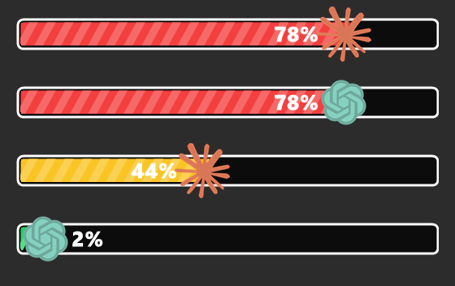
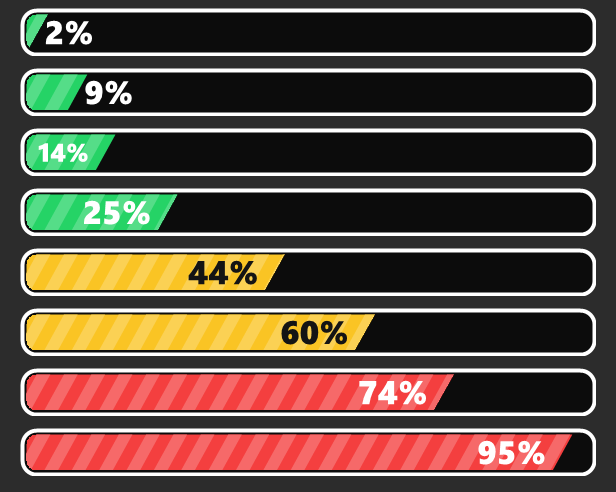

# Usage A.I — versão Windows

Monitor de uso do **Claude** e do **ChatGPT (Codex)** na bandeja do Windows.
Um ícone ao lado do relógio mostra, num olhar, quanto já foi gasto das cotas
dos dois serviços.

Prévia que aparece ao passar o mouse no ícone da bandeja:

Barras do painel de detalhes, com as cores por faixa de uso:

## Requisitos

- Windows 10 ou 11
- **Claude Code** e/ou **Codex** instalados e logados. O app lê os tokens de
  onde os próprios CLIs já os guardam:
  - Claude: `%USERPROFILE%\.claude\.credentials.json`
  - Codex: `%USERPROFILE%\.codex\auth.json`
- Nada mais: é PowerShell puro, sem instalação e sem dependências.

## Como usar

Dois cliques em **`Iniciar Usage A.I.vbs`** (abre sem janela de console).

| Ação | O que acontece |
|---|---|
| **Passar o mouse** no ícone | Prévia com uma barra por serviço, com o logo da marca na ponta do preenchimento |
| **Clique esquerdo** | Painel com todas as cotas (Sessão 5h, Semanal, por modelo), plano contratado e horários de reset |
| **Clique direito** | Menu: Ver detalhes, Atualizar agora, Iniciar com o Windows, Sair |

As cores seguem o quanto já foi gasto: **até 30% verde**, **30% a 70% amarelo**,
**acima de 70% vermelho**.

## Detalhes técnicos

- **Coleta em segundo plano** — as chamadas HTTP rodam num *runspace* separado.
  A interface é liberada em ~20 ms enquanto a consulta (que leva ~2 s) continua
  nos bastidores, então o painel abre instantaneamente e o ícone nunca congela.
- **DPI por monitor** — o app se declara *Per-Monitor DPI Aware v2*, então
  renderiza nítido em telas com escala (150%, 200%) e em monitores mistos.
- **Desenho vetorial** — as barras e os números são desenhados com
  anti-aliasing e posicionados pelo contorno real do texto, não pelas métricas
  de linha da fonte.
- **Atualização automática** a cada 3 minutos, com instância única garantida
  por mutex.

## Arquivos

| Arquivo | Papel |
|---|---|
| `UsageAI.ps1` | O aplicativo inteiro |
| `Iniciar Usage A.I.vbs` | Atalho que abre sem console |
| `UsageAI.ico` | Ícone da bandeja |
| `LogoClaude.png` / `LogoChatGPT.png` | Símbolos das marcas |

## Segurança

- Os tokens são usados **somente** no cabeçalho `Authorization` das duas APIs
  oficiais: `api.anthropic.com` e `chatgpt.com`. Nenhum outro destino de rede.
- O app **não grava nada em disco**. A única exceção é a entrada de
  inicialização no registro (`HKCU`), criada apenas se você ativar
  "Iniciar com o Windows" — e removida ao desativar.
- Todo o código está em um único arquivo, `UsageAI.ps1`, para facilitar a auditoria.

## Versão para Mac

A adaptação para a barra de menus do macOS (Swift + AppKit) está em
[usage-ai-macos](https://github.com/jmschmitzco/usage-ai-macos).

---

*Projeto independente, sem vínculo com Anthropic ou OpenAI. "Claude", "ChatGPT"
e seus logos pertencem às respectivas empresas e aparecem aqui apenas para
identificar cada serviço.*
